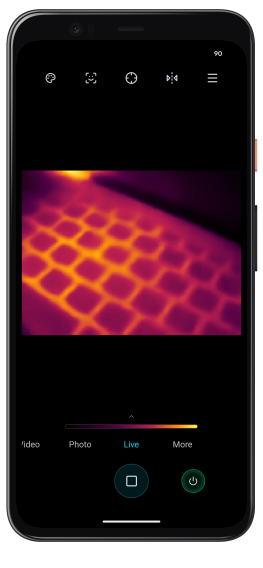
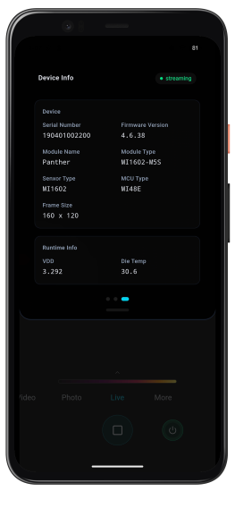
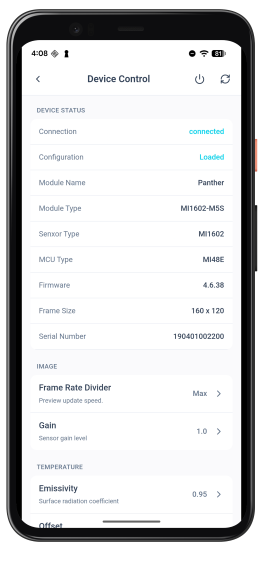

# SenXor Live

SenXor Live is the mobile companion app for SenXor thermal imaging sensors. It connects to compatible SenXor devices, shows a real-time thermal preview with temperature readouts, and lets you configure sensor settings, capture thermal images and recordings, and manage device calibration from your phone or tablet.

## Features

- **Live Preview** — Real-time thermal imaging with live, photo, and video modes.
- **Temp Info** — Spot temperature at the crosshair and runtime sensor readings such as die temperature.
- **Colorbar** — Temperature scale below the preview, mapping colors to the current range.
- **Device Settings** — Connection, image processing, and temperature measurement parameters.
- **Device Info** — Hardware details, firmware version, frame size, and streaming status.
- **Photo & Video** — Capture thermal snapshots and recordings from the preview screen.

## Screenshots

